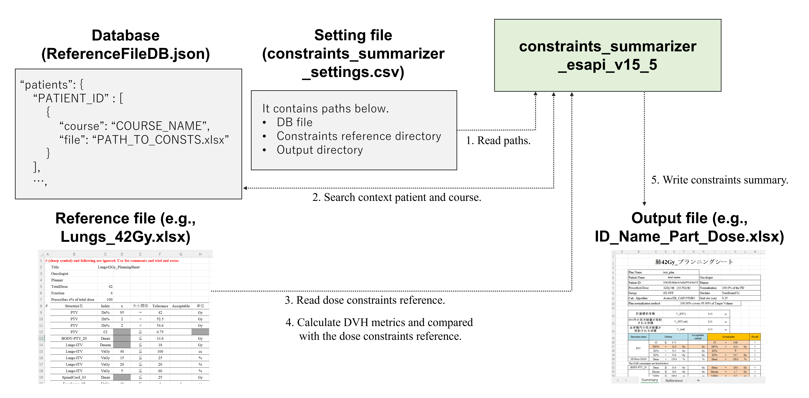

# constraints_summarizer_esapi_v15_5

The plan (or plan sum)'s DVH metrics are extracted and compared with arbitrary dose constraints and the results are output to an Excel file (.xslx).

An overview of the process is given below.

This is in the process of i8n.

## How to use

1. Open the plan you would like to process (you can also make a plan selection later without opening anything).

2. Call the script.

3. If the ID and Course of the patient are not written in the DB file, select the dose constraints reference file in the file dialog.

4. The results of the DVH metrics analysis are displayed (see figure below). In the figure below, the constraint "D95% = 42 Gy" shown as not satisfied, but this is due to rounding by normalization and the dose constraint is actually satisfied.

   

5. (You can change the analyzed plan by clicking on ‘Change Plan’ at the bottom of the window, and change the dose constraints reference file by clicking on ‘Change Constrains Sheet’.) 

6. Click on ‘Add Summary Sheet’ to output an Excel file.

### Setup

- The following paths can be defined in the [constraints_summarizer_settings.csv]() file.

  - Database file path

  - Default directory to look for dose constraints reference files 

  - Default directory for output files 

- The [ReferenceFileDB.json]() file stores the dose constraints reference files required for script execution, for each Patient ID, Course.

- [Lung42Gy_Planning_sheet.xlsx]() is a example dose constraints reference file, which can be rewritten to analyze with any dose constraint.

## LICENSE

Released under the MIT license.

No responsibility is assumed for anything that occurs with this software.

See [LICENSE](https://github.com/akiaji-k/plan_checker_gui_esapi_v15_5/blob/main/LICENSE) for further details.

