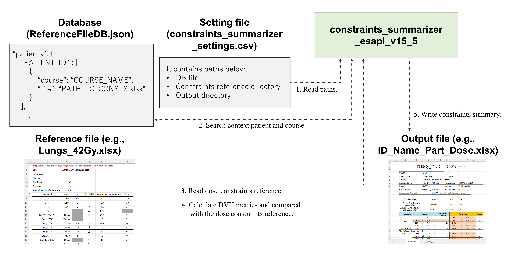
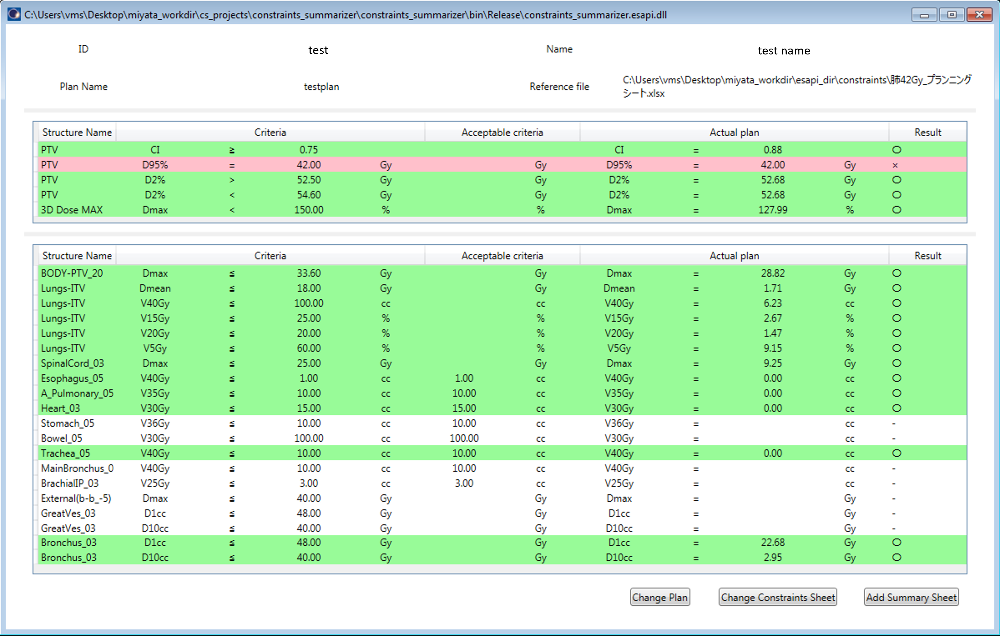

# constraints_summarizer_esapi_v15_5

Plan (or Plan Sum) の線量指標の値を抽出し、任意の線量制約と比較判定して、結果をエクセルファイルに出力します。

以下に動作の概要を示します。

本ソフトウェアの多言語への翻訳は途中です。

## 使用方法

1. 処理したいプランを開きます (何も開かなくても、あとでプラン選択をすることもできます)。

2. スクリプトを呼び出します。

3. 呼び出し患者の ID, Course が DB に無い場合は、参照する線量制約ファイルをファイルダイアログで指定します。

4. DVH metrics の解析結果が表示されます（下図）。下図では $D95%$ の等号が満たされていないと表示されていますが、これは Normalization の丸めによるものであり、実際には線量制約を満たしています。

   

5. （実行画面下部の "Change Plan" をクリックして解析対象プランの変更、"Change Constrains Sheet" をクリックして参照する線量制約ファイルを変更できます。）

6. "Add Summary Sheet" をクリックし、エクセルファイルを出力します。

### 設定方法

- [constraints_summarizer_settings.csv](https://github.com/akiaji-k/constraints_summarizer_esapi_v15_5/blob/main/constraints_summarizer_settings.csv) ファイルで以下のパスを指定可能です。

  - Database ファイルのパス

  - 「参照する線量制約ファイル」を探すディレクトリの初期値

  - 「ファイルを出力する」ディレクトリの初期値

- [ReferenceFileDB.json](https://github.com/akiaji-k/constraints_summarizer_esapi_v15_5/blob/main/ReferenceFileDB.json) ファイルは、スクリプト実行に必要となる参照線量制約ファイルを、患者 ID, Course 毎に保存しています。

- [肺42Gy_プランニングシート.xlsx](https://github.com/akiaji-k/constraints_summarizer_esapi_v15_5/blob/main/%E8%82%BA42Gy_%E3%83%97%E3%83%A9%E3%83%B3%E3%83%8B%E3%83%B3%E3%82%B0%E3%82%B7%E3%83%BC%E3%83%88.xlsx) は参照線量制約ファイルのサンプルで、これを書き換えることで任意の線量制約で解析することができます。

## ライセンス

MIT ライセンスで公開されています。

本ソフトウェアで発生したことについて、いかなる責任も負いません。

詳細は [LICENSE](https://github.com/akiaji-k/constraints_summarizer_esapi_v15_5/blob/main/LICENSE) をご確認ください。

